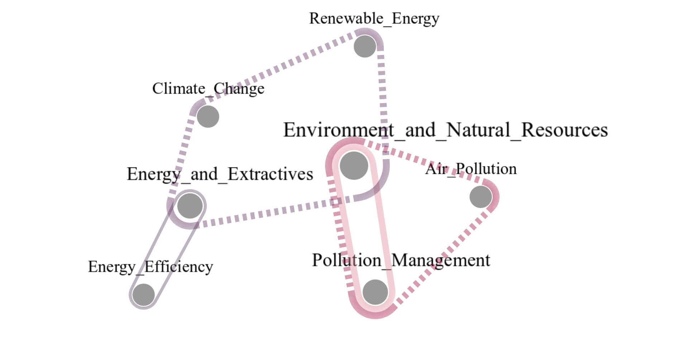

# HyperGodot: Interactive Hypergraph Visualization Tool

**HyperGodot** is an interactive, feature-rich visualization tool for hypergraphs, designed for advanced exploration and analysis of complex multi-actor relationships. Built using the Godot Engine, it supports dynamic layout computation, user customization, and comparative analysis through temporal or grouped hypergraphs.

## 🧠 Key Features

- **Multiple Layouts**: Force-directed and circular layouts for vertex positioning.
- **Convex Hull Edge Drawing**: Uses Andrew’s monotone chain algorithm for rendering hyperedges with minimal overlap.
- **Configurable Visualization**:
  - Define node sizes and edge widths using mathematical expressions.
  - Adjustable point count for rendering smoothness.
  - Edge and node coloring.
- **Temporal and Grouped Hypergraph Support**:
  - Compare multiple hypergraph structures using groups and line styles (solid/dashed).
- **Interactive UI**:
  - Drag to reposition nodes.
  - Select node to filter visible edges.
  - Camera controls for navigation and zoom.

## 📁 Input Format

Input hypergraphs are plain text files using a space-separated format per hyperedge. Each line defines a hyperedge and may include tags:

```txt
v1 v2 v3 #WEIGHT: 12 #GROUP: 2023
v4 v5    #WEIGHT: 8  #GROUP: 2022
```
WEIGHT: numeric value representing edge weight (e.g., frequency, strength).

GROUP: label for grouping edges (e.g., year, category, temporal slice).

## Configuration File (conf.cfg)

Users can customize the behavior and appearance of the visualization using a config file. Parameters include layout type, mathematical expressions for edge width and node size, and camera/export settings.

Example configuration:

[graph_settings]
point_count = 12
edge_width_expression = "weight * 0.2 + 1"
node_radius_expression = "30 + 100 * (centrality / total_nodes)"
layout = "force-directed"
parameters = [500, 250.0, 30.0]
#screenshot_path = "C:\\Users\\YourName\\Documents\\screenshots"

## Example output:
	
